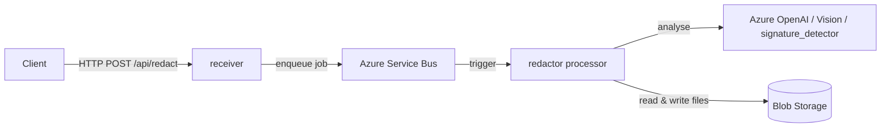

# PINS Redaction System

This repository defines the automated redaction tooling available to PINS services. It
scans documents (currently PDFs) for personal and sensitive information and applies
redactions, either automatically or via a human-reviewed provisional/apply workflow.

> This is a **getting started** guide. For full system architecture, design decisions, and
> operational documentation, see the team's Confluence space: [Redaction System | Confluence](https://pins-ds.atlassian.net/wiki/spaces/AS2/pages/2472050702/Redaction+System).

## How it works

A request to process a file is sent via HTTP to the **receiver**, which queues a job on Azure Service Bus.
The **redactor** (processor) picks the job up and runs it through a Durable Functions
orchestration, calling out to Azure OpenAI / Azure AI Vision / the `signature_detector`
service as needed, before writing the result back to Blob Storage.



## How the redaction engine works

For how the redactor and file processor work and how the prompt config is used, see
[redactor/src/redaction/readme.md](redactor/src/redaction/readme.md).

## Posting HTTP requests to the function app

The receiver Function App ([receiver/function_app.py](receiver/function_app.py)) exposes
three POST routes. Each just validates the request body and queues a Service Bus message for
the processor to pick up:

| Route | Stage queued | Purpose |
| --- | --- | --- |
| `POST /api/redact` | `ANALYSE` | Run analysis and add provisional redactions |
| `POST /api/apply` | `REDACT` | Convert provisional redactions into permanent ones |
| `POST /api/sanitise` | `SANITISE` | Strip hidden content/metadata from the file |

All three expect a JSON body shaped like:

```json
{
  "fileKind": "pdf",
  "configName": "default",
  "readDetails": {
    "storageKind": "AzureBlob",
    "teamEmail": "someAccount@planninginspectorate.gov.uk",
    "properties": {
      "blobPath": "samples/source.pdf",
      "storageName": "mystorageaccount",
      "containerName": "mycontainer"
    }
  },
  "writeDetails": {
    "storageKind": "AzureBlob",
    "teamEmail": "someAccount@planninginspectorate.gov.uk",
    "properties": {
      "blobPath": "samples/source_REDACTED.pdf",
      "storageName": "mystorageaccount",
      "containerName": "mycontainer"
    }
  }
}
```

`configName` selects which `config/*.yaml` file to use (defaults to `default`, see
[redactor/src/redaction/readme.md](redactor/src/redaction/readme.md#the-prompt-config-configdefaultyaml)).
The response is `{"id": "<job_id>"}`. The processor runs the job asynchronously via Durable
Functions — poll its status endpoint to track progress.

For a full working example against a locally running receiver, see
[scripts/trigger_redaction.py](scripts/trigger_redaction.py), or run `make trigger` from the
repo root after `make run`.

For the full API reference (all parameters, defaults, and storage backend options), see the
team's "API documentation" Confluence page: [Redaction System | Confluence](https://pins-ds.atlassian.net/wiki/spaces/AS2/pages/2472050702/Redaction+System).

## Prerequisites

- Python 3.13
- git
- [uv](https://docs.astral.sh/uv/) (recommended) or pip

Only needed if you want to run the Function Apps locally (see [Run it locally](#run-it-locally-optional)):
- [Azure Functions Core Tools](https://learn.microsoft.com/en-us/azure/azure-functions/functions-run-local?tabs=macos%2Cisolated-process%2Cnode-v4%2Cpython-v2%2Chttp-trigger%2Ccontainer-apps&pivots=programming-language-python)
- [Azurite](https://learn.microsoft.com/en-us/azure/storage/common/storage-use-azurite)

Only needed for integration/e2e/perf tests (see [Testing](#testing)):
- Azure CLI, logged in (`az login`) to the expected subscription
- Connected to the **PINS VPN**

## Project layout

```
├── redactor/               // The processor Function App + core redaction logic
│   ├── function_app.py     // Service Bus trigger + Durable Functions orchestrator
│   ├── src/                // Core package: analysis/, api/, config/ (default.yaml), io/, monitoring/, redaction/
│   └── tests/              // unit/, integration/, e2e/, perf/, smoke/, resources/
├── receiver/               // The receiver Function App (HTTP entrypoint)
├── signature_detector/     // Separate Dockerized signature-detection scoring service
├── infrastructure/         // Terraform for the Azure environment
├── pipelines/              // Azure DevOps pipeline definitions
└── scripts/                // Utility scripts, e.g. scripts/trigger_redaction.py
```

## Install dependencies

Both approaches read the same [pyproject.toml](pyproject.toml).

### Option A: uv (recommended)

```bash
uv sync --group dev
```

### Option B: pip

```bash
python -m venv .venv
source .venv/bin/activate  # on Windows: .venv\Scripts\activate
pip install -e .[dev]
```

`redactor/requirements.txt` and `receiver/requirements.txt` are the pinned dependency lists
Azure actually deploys to each Function App — you don't need to install them manually for
local development.

### Install pre-commit hooks

```bash
pre-commit install
```

This runs `ruff check` / `ruff format`, `detect-secrets`, and `bandit` automatically on every
commit. You can also run all hooks on demand:

```bash
pre-commit run --all-files
```

## Environment variables

Copy [.env.example](.env.example) to `.env` in the repo root and fill in real values:

```bash
cp .env.example .env
```

| Variable | Description |
| -------- | ----------- |
| `OPENAI_ENDPOINT` | Azure OpenAI endpoint used for LLM-based text redaction |
| `AZURE_VISION_ENDPOINT` | Azure AI Vision endpoint used for image analysis |
| `SIGNATURE_DETECTOR_ENDPOINT` | Endpoint for the `signature_detector` service |
| `STORAGE_NAME` | Azure Storage account used to read/write files being redacted |
| `AZURE_SERVICE_BUS_NAMESPACE` | Service Bus namespace used by the receiver |
| `AZURE_SERVICE_BUS_NAMESPACE_CONNECTION_STRING` | Connection string used by the redactor's trigger binding |
| `APP_INSIGHTS_CONNECTION_STRING` | Application Insights connection string (needed to run the Function Apps or integration tests locally) |

`.env.example` also lists the additional `E2E_*` variables needed for e2e/perf tests.

## Run it locally (optional)

You don't need to run the Function Apps locally to contribute — see
[Validating changes without a local setup](#validating-changes-without-a-local-setup) for a
no-install alternative.

If you do want to run everything locally:

```bash
make run
```

This starts Azurite plus both Function Apps (receiver on port 7071, processor on port 7072)
in the background, logging to `/tmp/azurite.log`, `/tmp/func_receiver.log`, and
`/tmp/func_processor.log`. Once they're up, trigger a sample redaction:

```bash
make trigger
```

which runs [scripts/trigger_redaction.py](scripts/trigger_redaction.py) — a small script that
POSTs to the receiver and polls the job until it completes.

## Validating changes without a local setup

Opening or updating a pull request against `main` automatically triggers the **Redaction CI**
pipeline ([pipelines/redaction-ci.yml](pipelines/redaction-ci.yml)) in Azure DevOps. It runs
linting, unit tests, integration tests, and e2e tests against its own self-hosted Azurite and
Function App instances — no local setup or VPN required for CI itself.

You can also run this pipeline without opening a PR: in Azure DevOps, go to
**Pipelines → Redaction CI → Run pipeline** and pick your branch.

Performance tests are a separate pipeline
([pipelines/redaction-perf-test.yml](pipelines/redaction-perf-test.yml)) that must always be
triggered manually in Azure DevOps (**Pipelines → Redaction Perf → Run pipeline**).

## Testing

### Unit tests

No external services required:

```bash
cd redactor
pytest tests/unit
```

### Integration tests

Require Azure CLI login (`az login`) and the **PINS VPN**:

```bash
cd redactor
pytest tests/integration
```

### E2E and perf tests

Also require the PINS VPN and Azure CLI login, plus the `.env` E2E variables and both Function
Apps running locally (see [Run it locally](#run-it-locally-optional)).

1. Start local services:
   - `make run`
2. In another terminal, run e2e tests:
   - `make e2e`
3. Run perf tests:
   - `make perf`

Optional perf tuning:

```bash
PERF_TOTAL=20 PERF_CONCURRENCY=5 PERF_TIMEOUT_S=1200 make perf
```

## Where to go next

For full system architecture, design decisions, and operational runbooks, see the team's
Confluence space: [Redaction System | Confluence](https://pins-ds.atlassian.net/wiki/spaces/AS2/pages/2472050702/Redaction+System).

